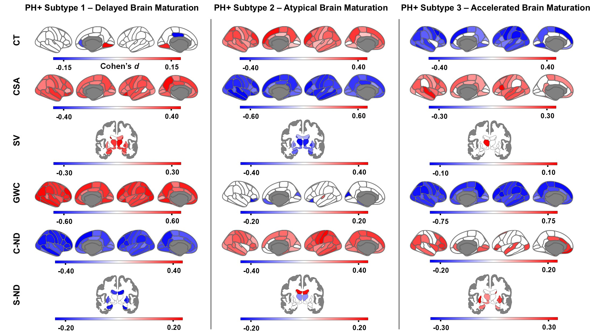

# brain-risk-hybrid-ML-engine

Production-grade 3D MRI preprocessing and dual-track ML pipeline for neuropsychiatric risk modeling: raw NIfTI → MNI-standardized 64³ volumes for ViT/MINiT deep learning + ROI extraction for semi-supervised clustering, validation, and clinical characterization. Distributed PyTorch (DDP) on HPC and reproducible Docker/CI. Applied to the ABCD cohort.

## About

This project is based on my MSc analyses of **thousands of multi-site MRI scans from the [ABCD Study](https://abcdstudy.org/)** and approaches a pressing clinical problem (described below) as **an end-to-end analytical and engineering challenge**: building a reproducible neuroimaging pipeline that transforms raw MRI into analysis-ready features and standardized volumes which feed ML baselines, statistical analyses, and modern transformer-based models.

---

## Clinical Context

> * Children of parents with psychiatric illness face elevated risk for developing mental health disorders, but outcomes are strikingly heterogeneous: **some deteriorate, others remain resilient, and conventional clinical markers cannot reliably distinguish who will follow which trajectory**. Identifying divergent neurodevelopmental pathways before symptoms emerge would enable earlier intervention during adolescence, when brain maturation is most rapid.
>
> * The modeling challenge is non-trivial: **risk signals in brain structure are subtle, distributed, and embedded in high-dimensional MRI volumes collected at scale** (thousands of scans acquired across multiple sites), alongside longitudinal clinical and environmental measures. Raw volumetric data must be transformed into representations that generalize across downstream tasks such as subtyping, prediction, and validation.

## Architecture

```
            Raw MRI (.nii / .nii.gz)
                       │
                       ▼
     ┌──────────────────────────────────────┐
     │          Shared Core                 │
     │  NIfTI ingestion → FreeSurfer        │
     │  recon-all (skull strip, parcellate) │
     └──────┬───────────────────────┬───────┘
            │                       │
            ▼                       ▼
 ┌──────────────┐    ┌───────────────────────────┐
 │  ROI Branch  │    │      DL Branch            │
 │  (Trad. ML)  │    │                           │
 │              │    │  brainmask.mgz →          │
 │  FreeSurfer  │    │  MNI305 warp → crop →     │
 │  ROI table   │    │  normalize → pad →        │
 │  extraction  │    │  resample 64³ → reorient  │
 └──────┬───────┘    └────────────┬──────────────┘
        │                         │
        ▼                         ▼
┌───────────────────┐    ┌────────────────────────┐
│  Semi-supervised  │    │   ViT / MINiT          │
│  Clustering       │    │   Training (DDP)       │
│  + Baselines      │    │   + Experiment Log     │
└──────┬────────────┘    └──────────┬─────────────┘
       │                            │
       └──────────────┬─────────────┘
                      ▼
            Clinical Interpretation
```

## Traditional ML Track

The traditional ML track has three components:

**Semi-supervised clustering:** Healthy-control youth serve as the normative reference to identify distinct at-risk neurobiological subtypes. Cross-validated ARI selected k=3, and permutation testing supported stability.

**Subtype characterization:** ANCOVAs, effect sizes, and RCI analyses quantified subtype differences and 3-year clinical trajectories.

**ROI baselines:** Models trained on FreeSurfer ROI features confirmed subtype separability and modest predictive signal in brain morphometry.

## Quick Start

```bash
git clone https://github.com/julcambec/brain-risk-hybrid-ML-engine.git
cd brain-risk-hybrid-ML-engine
make install
make demo-preprocessing-pipeline
```

The demo generates synthetic data and runs both the traditional ML and deep learning preprocessing branches, producing artifacts in `artifacts/` and a QC report in `artifacts/reports/`.

## Tech Stack

Python · PyTorch · scikit-learn · FreeSurfer · nibabel · SciPy · NumPy · pandas · Click

## Key Results

Children (ages 9–10) from the ABCD Study:

* **3 neurobiologically distinct subtypes** emerged via semi-supervised HYDRA clustering, each with unique imaging signatures, environmental correlates, and clinical trajectories: *Subtype 1* (Delayed Brain Maturation), *Subtype 2* (Atypical Brain Maturation), and *Subtype 3* (Accelerated Brain Maturation).

<p align="center">
  
  <br/>
  <em>Figure: Regional neuroimaging signatures (covariate-adjusted Cohen's d) for each PH+ subtype versus PH− controls across six imaging modalities.</em>
</p>

* **ROI baselines**: ROI morphometric features predicted HYDRA subtype membership (F1-macro = 0.80 vs 0.36 dummy) income (R² = 0.12), and maternal substance use (F1 = 0.54) above dummy baselines.
* **ViT sex classification**: ~80% validation accuracy, confirming the DL pipeline captures biologically meaningful signal from volumetric data.
* **ViT subtype classification**: achieved a +10 percentage point improvement over the 35% dummy baseline — demonstrating ability to extract sutble signal in inter-class differences. Next steps include contrastive pre-training, stronger domain-specific data augmentation, and exploration of hybrid 3D-CNN–Transformer architectures.

> **Note:** All results above are from the real ABCD dataset. Demo mode uses synthetic data for pipeline validation only.

## Data Availability & Use Statement

* The ABCD Study data used in this project were obtained from the NIMH Data Archive (NDA) under an approved Data Use Certification.
* This repository does not contain any ABCD Study data, subject-level results, or identifiable participant information.
* Only aggregate, group-level summaries (e.g., subtype-level findings) are included. These summaries correspond to results previously disseminated in the author’s MSc thesis and do not permit identification of individual participants.

## Acknowledgments

* **Data**: [ABCD Study](https://abcdstudy.org/) (Release 2.0 baseline, Release 4.0 follow-up). The ABCD Study is supported by the National Institutes of Health.
* **MINiT architecture**: Adapted from Singla et al., "Multiple Instance Neuroimage Transformer" (2022).
* **HYDRA clustering**: Varol et al., "HYDRA: Revealing heterogeneity of imaging and genetic patterns through a multiple max-margin discriminative analysis framework" (2017).
* **MSc research**: Conducted at the University of British Columbia (UBC), Vancouver.

## License

[MIT](LICENSE)
