# BrainRisk: A Hybrid Neuroimaging ML Engine for Neuropsychiatric Risk Modeling

Production-grade 3D MRI preprocessing and dual-track ML pipeline for neuropsychiatric risk modeling: raw NIfTI → MNI-standardized 64³ volumes for ViT/MINiT deep learning + ROI extraction for semi-supervised clustering, validation, and clinical characterization. Distributed PyTorch (DDP) on HPC and reproducible Docker/CI. Applied to the ABCD cohort.


[About](#about) · [Repo Structure](#structure) · [Pipeline Overview](#pipeline-overview) · [Quick Start](#quick-start) · [Key Results](#key-results)

---

## About

This project is based on my MSc analyses of **thousands of multi-site MRI scans from the [ABCD Study](https://abcdstudy.org/)** and approaches a pressing clinical problem (described below) as **an end-to-end analytical and engineering challenge**: building a reproducible neuroimaging pipeline that transforms raw MRI into analysis-ready features and standardized volumes which feed ML baselines, statistical analyses, and modern transformer-based models.

## Clinical Context

> * Children of parents with psychiatric illness face elevated risk for developing mental health disorders, but outcomes are strikingly heterogeneous: **some deteriorate, others remain resilient, and conventional clinical markers cannot reliably distinguish who will follow which trajectory**. Identifying divergent neurodevelopmental pathways before symptoms emerge would enable earlier intervention during adolescence, when brain maturation is most rapid.
>
> * The modeling challenge is non-trivial: **risk signals in brain structure are subtle, distributed, and embedded in high-dimensional MRI volumes collected at scale** (thousands of scans acquired across multiple sites), alongside longitudinal clinical and environmental measures. Raw volumetric data must be transformed into representations that generalize across downstream tasks such as subtyping, prediction, and validation.

## Structure

```
brain-risk-hybrid-ML-engine/
│
├── Makefile
├── Dockerfile
├── pyproject.toml
├── environment.yml
├── configs/
├── infrastructure/
├── tests/                      # pytest suite
├── notebooks/                  # Curated analytical notebooks
│
└── src/brainrisk/
    ├── preprocessing/          # Shared core + dual-branch volume/ROI processing
    │   ├── nifti_io.py         #   NIfTI loading, validation, QC
    │   ├── mni305.py           #   Talairach affine warp to MNI305 space
    │   ├── volume_standardization.py  # Orchestrator: warp→crop→normalize→pad→resample→reorient
    │   ├── roi_extraction.py   #   ROI table construction + schema validation
    │   ├── pipeline.py         #   Top-level orchestrator with explicit branching
    │   └── ...                 #   freesurfer.py, normalization.py, resampling.py, orientation.py
    │
    ├── deeplearning/           # MINiT architecture, training, DDP utilities
    │   ├── model.py            #   Multiple Instance Neuroimage Transformer (MINiT)
    │   ├── layers.py           #   Transformer building blocks (GEGLU, MSA, FFN, encoder)
    │   ├── trainer.py          #   Training loop (DDP-aware, checkpointing, logging)
    │   ├── augmentation.py     #   MixUp augmentation for 3D volumes
    │   ├── freeze.py           #   Layer freezing strategies for fine-tuning
    │   └── ...                 #   utils.py (DDP setup), dataset.py
    │
    ├── baselines/              # ROI-based predictive models
    │   ├── classifiers.py      #   Classification pipelines (Dummy, HistGBT, Logistic)
    │   ├── regressors.py       #   Regression pipelines (Dummy, HistGBT, Ridge)
    │   └── interpretation.py   #   Feature importance + brain atlas mapping
    │
    ├── clustering/             # Semi-supervised subtype discovery
    │   ├── hydra.py            #   HYDRA clustering (sklearn stand-in + MATLAB stub)
    │   ├── evaluation.py       #   ARI, permutation testing, model selection across k
    │   └── characterization.py #   ANCOVAs, chi-squared, effect sizes, longitudinal RCI
    │
    ├── data/                   # Data loading, synthetic generation for demos, splitting
    ├── utils/                  # Config, logging, visualization
    └── cli.py                  # Click CLI (demo-preprocessing, demo-ml, demo-dl)
```

---

## Pipeline Overview

### Raw MRI → Shared Preprocessing Core

The pipeline starts from raw T1-weighted NIfTI scans. Structural preprocessing includes skull stripping, Talairach alignment, and cortical parcellation, producing both the skull-stripped brainmask and the cortical surface reconstructions that feed both downstream tracks.

<p align="center">
  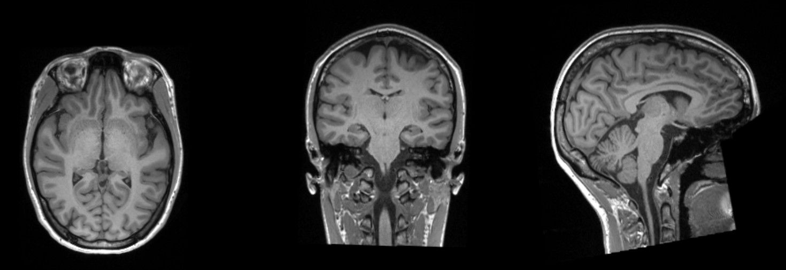
</p>

<p align="center">
  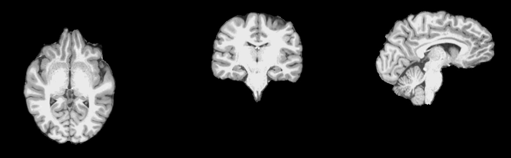
</p>

<p align="center">
  <em>Top: Raw T1-weighted MRI. Bottom: Skull-stripped brainmask after motion correction, intensity correction, Talairach transform, normalization, and skull stripping. Subject from the OpenNeuro NYU Retinotopy Dataset (CC0).</em>
</p>

```
Raw NIfTI (.nii/.nii.gz) → shared preprocessing → brainmask.mgz + cortical parcellation
                                                        │                   │
                                                        ▼                   ▼
                                                    DL Branch           ROI Branch
                                                    (§ below)           (§ below)
```

The full pipeline is configurable via [`configs/preprocessing.yaml`](configs/preprocessing.yaml) and executable through a single CLI command (`brainrisk demo-preprocessing`). The orchestration logic (incl. dual-branch dispatch) lives in [`src/brainrisk/preprocessing/pipeline.py`](src/brainrisk/preprocessing/pipeline.py).

From here, the pipeline branches into two parallel tracks.

### Deep Learning Track

The skull-stripped brainmask is warped to MNI305 space via the subject-specific Talairach affine, then tight-cropped, min–max normalized, centered-padded, resampled to a fixed 64³ isotropic grid, and reoriented to a canonical axis order. These standardized volumes feed **MINiT** (Multiple Instance Neuroimage Transformer), ***our in-house re-implementation*** of the hierarchical, convolution-free architecture proposed by Singla et al. (2022). It decomposes each volume into non-overlapping 3D blocks, processes them through a shared ViT encoder with learned block-position embeddings, and aggregates per-block predictions into a final classification. The implementation (e.g., see [`src/brainrisk/deeplearning/model.py`](src/brainrisk/deeplearning/model.py)) includes full tensor shape trace in the docstrings and documents engineering decisions.

<p align="center">
  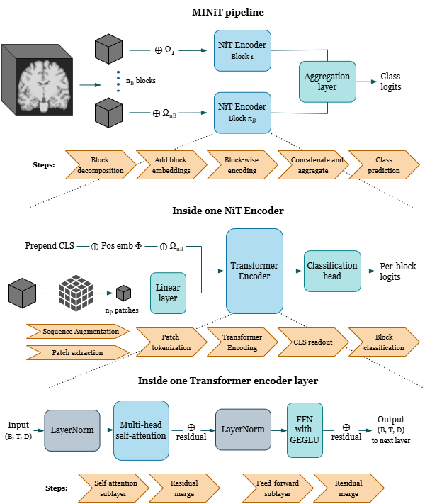
  <br/>
  <em>Architecture of the Reimplemented MINiT: volume → block decomposition → per-block ViT encoder → prediction aggregation. MINiT was originally proposed by Singla et al. (2022).</em>
</p>

**Sex classification (~80% validation accuracy)** confirmed that the preprocessing pipeline and model architecture are functional. MINiT outperformed the standard NiT (~80% vs ~73%), supporting the block-based architecture's advantage for preserving local spatial structure in brain volumes.

<p align="center">
  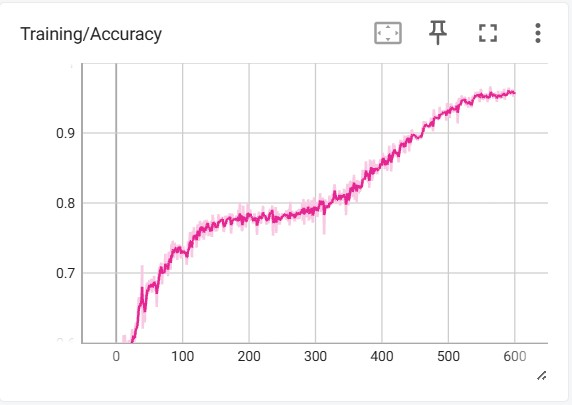
  &nbsp;&nbsp;&nbsp;&nbsp;
  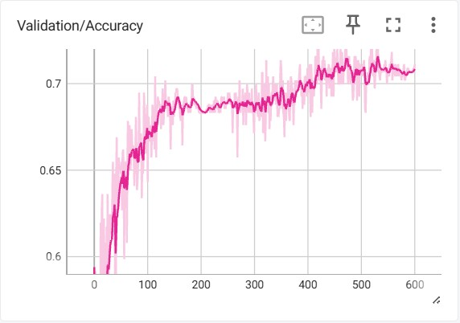
</p>

<p align="center">
  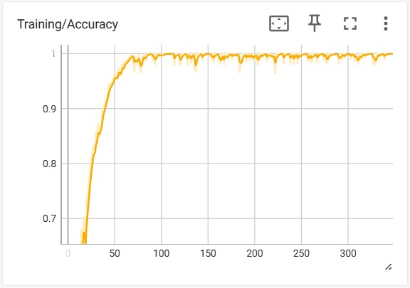
  &nbsp;&nbsp;&nbsp;&nbsp;
  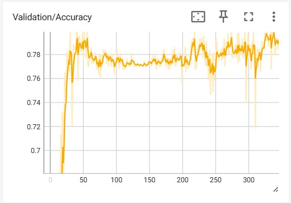
</p>

<p align="center">
  <em>Top: NiT sex classification. Bottom: MINiT sex classification, best configuration. Left: training accuracy. Right: validation accuracy.</em>
</p>

**HYDRA subtype classification achieved a consistent +15 percentage point improvement over chance (~33%)** following systematic optimization of regularization, learning rates, freezing strategies, batch sizes (64–256 effective), and multi-GPU DDP training. The signal exists (the model consistently beats chance), but is rather subtle and distributed for end-to-end volumetric learning from 941 samples. This is consistent with the ROI-level features in the HYDRA subtypes: patterns defined by regionally summarized features are harder for a ViT to rediscover from raw voxels without heavy augmentation.

The full experimental progression, NiT → MINiT, sex → subtype → regression, 15+ ablations across hyperparameters and freezing strategies, is documented in [`experiments/05_volumetric_transformer_training_and_ablation.md`](experiments/05_volumetric_transformer_training_and_ablation.md), with reference configurations (e.g., see [`configs/vit_sex_classification.yaml`](configs/vit_sex_classification.yaml)).

All training was conducted on UBC Sockeye (NVIDIA V100 32GB GPUs) with DDP via NCCL; infrastructure configuration is documented in [`infrastructure/hpc_setup.md`](infrastructure/hpc_setup.md).

### ROI-based ML Track

Full brain parcellation and segmentation produces **ROI feature tables** spanning cortical thickness, surface area, and subcortical volumes. These are complemented by gray–white contrast (GWC) and neurite density index (NDI) derived metrics, resulting in approximately 400 features per subject, harmonized across 22 acquisition sites with ComBat.

<p align="center">
  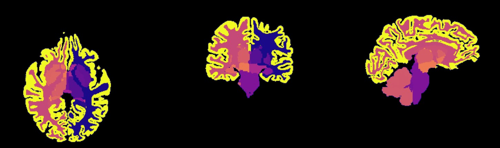
</p>

<p align="center">
  <em>Cortical parcellation and segmentation (Desikan–Killiany atlas), showing region-of-interest (ROI) labels used to derive features for clustering and baseline models. Subject from the OpenNeuro NYU Retinotopy Dataset (CC0).</em>
</p>

**Semi-supervised HYDRA clustering** (Varol et al., 2017) uses healthy-control youth as a normative reference to identify distinct at-risk neurobiological subtypes. Cross-validated ARI selected k=3, and permutation testing confirmed stability (p < 0.05). Three subtypes emerged, each with unique imaging signatures, environmental correlates, and clinical trajectories:

| Subtype | Label | Key Neuroimaging Pattern |
|---|---|---|
| **S1** | Delayed Brain Maturation | Expanded surface area + subcortical volumes, elevated GWC, reduced NDI |
| **S2** | Atypical Brain Maturation | Increased cortical thickness + NDI, reduced surface area/volume |
| **S3** | Accelerated Brain Maturation | Pronounced cortical thinning, increased surface area, reduced GWC, elevated NDI |

Subtype characterization (imaging ANCOVAs with FDR correction, non-imaging comparisons with effect sizes (Cohen's d, Cramér's V), and longitudinal Reliable Change Index analysis) is implemented in [`src/brainrisk/clustering/characterization.py`](src/brainrisk/clustering/characterization.py).

<p align="center">
  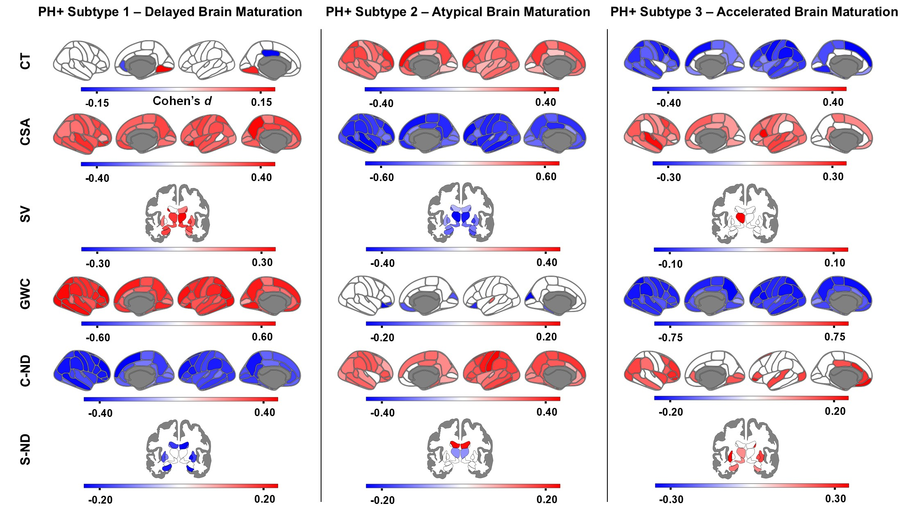
  <br/>
  <em>Regional neuroimaging signatures (covariate-adjusted Cohen's d) for each PH+ subtype versus PH− controls across six imaging modalities.</em>
</p>

**ROI baselines** confirmed that subtypes represent genuinely separable neurobiological patterns: HYDRA subtype classification achieved F1-macro = 0.80 (vs 0.36 dummy). Brain morphometry also carried modest but real predictive signal for family income (R² = 0.12) and maternal substance use (F1 = 0.54 vs 0.52 dummy). Feature importances from fitted pipelines are extracted and mapped to brain atlas regions in [`src/brainrisk/baselines/interpretation.py`](src/brainrisk/baselines/interpretation.py).

<p align="center">
  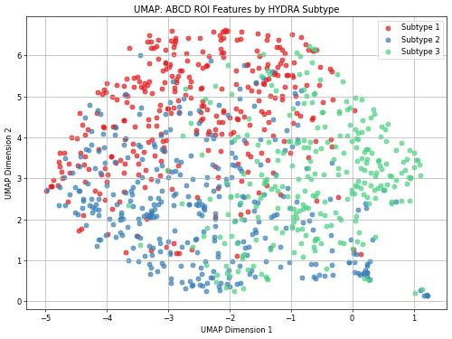
  &nbsp;&nbsp;&nbsp;&nbsp;
  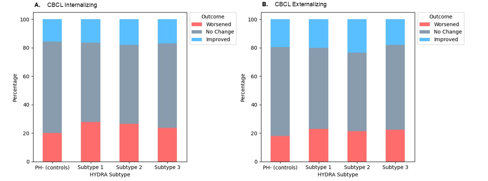
</p>

<p align="center">
  <em>Left: UMAP of ROI features showing partial but meaningful subtype separation. Right: 3-year reliable change in CBCL scores: Subtype 1 shows the highest proportion of worsening internalizing symptoms (27.8%).</em>
</p>

**Longitudinally**, subtypes predicted divergent 3-year clinical trajectories: Subtype 1 (Delayed Maturation) showed the highest rate of internalizing symptom escalation, while Subtype 3 (Accelerated Maturation) remained clinically stable despite familial risk, a resilient profile buffered by stronger peer networks and fewer environmental adversities.

**The analytical workflow is explored interactively in companion notebooks at [`notebooks/`](notebooks/)**.

---

## Quick Start

```bash
git clone https://github.com/julcambec/brain-risk-hybrid-ML-engine.git
cd brain-risk-hybrid-ML-engine
make install
make demo-preprocessing-pipeline
```

The demo generates synthetic data and runs both preprocessing branches, producing ROI features in `artifacts/` and a QC report in `artifacts/reports/`.

### Deep learning demo

The DL track (MINiT training) requires PyTorch:

```bash
make install
pip install torch
make demo-dl-track
```

This trains a small MINiT model for four epochs on synthetic 64³ volumes and writes a checkpoint and training log to `artifacts/dl/`. Completes in under 2 minutes on CPU.

### ROI-based ML demo

```bash
make demo-ml-track
```

Generates synthetic data, runs HYDRA clustering and ROI baselines (subtype classification, sex classification, income regression), and prints a summary.

### Docker

```bash
docker build -t brainrisk-demo .
docker run --rm brainrisk-demo make demo-preprocessing-pipeline
```

## Tech Stack

Python · PyTorch · scikit-learn · FreeSurfer · nibabel · SciPy · NumPy · pandas · Click

---

## Key Results

Children (ages 9–10) from the ABCD Study:

* **3 neurobiologically distinct subtypes** emerged via semi-supervised HYDRA clustering, each with unique imaging signatures, environmental correlates, and clinical trajectories: *Subtype 1* (Delayed Brain Maturation), *Subtype 2* (Atypical Brain Maturation), and *Subtype 3* (Accelerated Brain Maturation).

* **ROI baselines**: ROI morphometric features predicted HYDRA subtype membership (F1-macro = 0.80 vs 0.36 dummy), income (R² = 0.12), and maternal substance use (F1 = 0.54) above dummy baselines.

* **ViT sex classification**: ~80% validation accuracy, confirming the DL pipeline captures biologically meaningful signal from volumetric data.

* **ViT subtype classification**: achieved a +15 percentage point improvement over the 33% dummy baseline, demonstrating ability to extract subtle signal in inter-class differences. Next steps include contrastive pre-training, stronger domain-specific data augmentation, and exploration of hybrid 3D-CNN–Transformer architectures.

* **Longitudinal trajectories**: Subtype 1 showed the highest proportion of youth whose internalizing symptoms worsened over 3 years (27.8%), while Subtype 3 tracked closer to healthy controls (23.7% vs 20.0%), suggesting a resilient pattern.

---

## Data Availability & Use Statement

* The ABCD Study data used in this project were obtained from the NIMH Data Archive (NDA) under an approved Data Use Certification.
* This repository does not contain any ABCD Study data, subject-level results, or identifiable participant information.
* Only aggregate, group-level summaries (e.g., subtype-level findings) are included. All summaries have been previously disseminated in the author's MSc thesis and do not permit identification of individual participants.

## Acknowledgments

* **Data**: [ABCD Study](https://abcdstudy.org/) (Release 2.0 baseline, Release 4.0 follow-up). The ABCD Study is supported by the National Institutes of Health.
* **MINiT architecture**: Reimplemented from Singla et al., "Multiple Instance Neuroimage Transformer" (2022).
* **HYDRA clustering**: Varol et al., "HYDRA: Revealing heterogeneity of imaging and genetic patterns through a multiple max-margin discriminative analysis framework" (2017).
* **MSc research**: Conducted at the University of British Columbia (UBC), Vancouver.

## License

[MIT](LICENSE)
