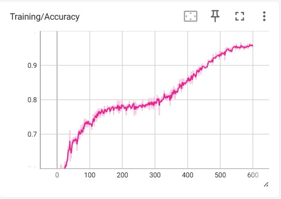
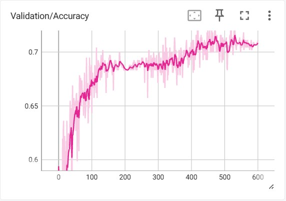
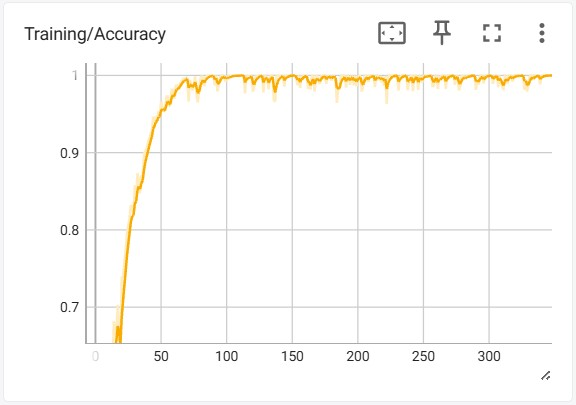
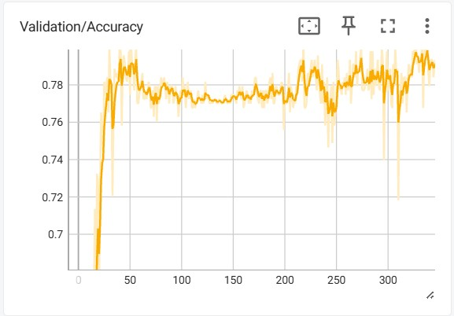

# ViT Experiment Log

## Overview

This document records the systematic experimental progression of applying Vision Transformer architectures: the Neuroimage Transformer (NiT) and Multiple Instance Neuroimage Transformer (MINiT), to volumetric T1-weighted MRI data from the ABCD Study. The goals were twofold: (1) validate the pipeline on a well-characterized task (sex classification), and (2) attempt HYDRA-defined subtype classification and continuous psychopathology prediction from raw brain volumes.

All experiments used 64³ isotropic brain volumes preprocessed through a FreeSurfer-based pipeline (skull stripping → MNI305 affine warp → crop → min–max normalize → pad → resample → reorient). Training and evaluation followed subject-level splits to prevent data leakage.

> **Key finding:** Sex classification reached ~80% validation accuracy with MINiT, confirming the data pipeline and model architecture are functional. Subtype classification consistently plateaued at ~45–48% validation accuracy (vs. ~33% chance) despite extensive hyperparameter search, freezing strategies, multi-GPU scaling, and augmentation tuning. Regression on continuous psychopathology scores collapsed to mean prediction. These results are consistent with the subtle, distributed nature of the neurobiological signal underlying HYDRA subtypes, a signal well-captured by ROI-level statistical methods but difficult for a ViT to learn end-to-end from limited samples.

**Experimental progression:**

1. **Sex classification (NiT)**: initial pipeline validation
2. **Sex classification (MINiT)**: architecture comparison and hyperparameter calibration
3. **HYDRA subtype classification (MINiT)**: the primary task, with systematic ablations
4. **CBCL psychopathology regression (MINiT)**: exploratory extension

All training was conducted on an HPC cluster (UBC Sockeye) using NVIDIA V100 32GB GPUs, with distributed data-parallel (DDP) training for multi-GPU experiments. Single-GPU experiments used a local workstation GPU for rapid iteration.

---

## 1. Sex Classification (NiT)

**Purpose:** Validate that the preprocessing pipeline and model architecture can learn a known, strong biological signal from volumetric MRI.

**Setup:** 1,710 training / 426 validation samples. NiT architecture. Binary classification.

| Phase | Run ID | Init Weights | Unfrozen Layers | LR | Dropout | Weight Decay | MixUp | Batch Size | Epochs | Train Acc | Val Acc | Notes |
|---|---|---|---|---|---|---|---|---|---|---|---|---|
| 1 | `07-18-44` | Random | All layers | default | default | default | default | default | 300 | ~53% | ~51% | Loss plateaued at ~0.69 (chance). |
| 3 | `16-30-35` | Phase 1 ckpt | All layers | 1e-4 | 0.0 | 1e-3 | 0.0 | 128 | 600 | ~95% | ~71% | Dramatic overfit. Model can memorize but not generalize. |
| 5 | `23-55-36` | Phase 3 best val ckpt (ep. 160) | All layers | 1e-4 | 0.1 | 1e-3 | 0.1 | 64 | 300 | ~94% | ~73% | Moderate regularization from best Phase 3 checkpoint. Final NiT configuration before switching to MINiT. |

> **Takeaway:** Full fine-tuning learns the training set but overfits heavily, suggesting the NiT's global token sequence may be suboptimal for 3D brain volumes. This motivated the switch to MINiT's block-based architecture.

  
  

  <em>Figure. Sex classification with NiT, Phase 3 (<code>16-30-35</code>). Left: training accuracy. Right: validation accuracy. Training accuracy rise toward ~95% while validation plateaus around ~71%.</em>

---

## 2. Sex Classification (MINiT)

**Purpose:** Test whether MINiT's block-based processing improves generalization over NiT on the same task. Calibrate hyperparameters for downstream subtype classification.

**Setup:** Same 1,710/426 split. MINiT architecture (non-overlapping 3D blocks → per-block ViT encoder → aggregated logits).

| Run | Run ID | Init Weights | MixUp | Dropout | Weight Decay | LR | Batch Size | Epochs | Best Val Acc | Notes |
|---|---|---|---|---|---|---|---|---|---|---|
| 1 | `21-54-36` | Random | 0.1 | 0.07 | 1e-3 | 1e-4 | 16 | 300 | ~50% | Stuck at chance. Moderate regularization on a randomly initialized MINiT prevents learning entirely. |
| 2 | `05-00-30` | Random | 0.0 | 0.0 | 1e-4 | 5e-4 | 16 | 350 | ~71% | Learned quickly (peak at ~epoch 9) then overfit rapidly. Checkpoint interval too coarse (every 20 epochs) — missed the best model. |
| 3 | `15-21-27` | Random | 0.01 | 0.05 | 3e-4 | 3e-4 | 16 | 300 | ~73% | Very light regularization slowed overfit onset. Confirmed that minimal MixUp + low dropout is the right regime for this data scale. |
| **4** | `18-58-34` | Random | 0.01 | 0.05 | 4e-4 | 1e-4 | **64** | 350 | **~80%** | **Best result.** Larger batch size on HPC (Sockeye) stabilized training dynamics. This configuration became the baseline for all downstream experiments. |

> **Takeaway:** MINiT outperforms NiT on this task (~80% vs. ~73%), likely because the block-based architecture preserves local spatial structure that the global NiT token sequence dilutes. The optimal regime is minimal regularization with moderate batch size. Run 4's hyperparameters and epoch-36 checkpoint became the initialization point for HYDRA subtype experiments.

**Key lesson from Run 2:** Checkpoint frequency matters. Saving every 20 epochs on a fast-learning model with rapid overfit means losing the best validation model. All subsequent experiments saved checkpoints more frequently.

  
  

  <em>Figure 2. Sex classification with MINiT, Run 4 (<code>18-58-34</code>). Left: training accuracy. Right: validation accuracy. The curves show stable convergence and peak validation performance of ~80%, motivating this configuration as the initialization point for downstream subtype experiments.</em>

---

## 3. HYDRA Subtype Classification (MINiT)

**Purpose:** The primary research question — can a Vision Transformer classify HYDRA-defined neurodevelopmental subtypes (3-class) from raw volumetric MRI? All experiments initialized from the sex-classification MINiT checkpoint (Run 4, epoch 36) and fine-tuned with a new 3-class classification head.

**Setup:** 941 PH+ participants. Three HYDRA subtypes (~34%/36%/30% split). Chance accuracy ~33%.

### 3.1 Regularization and Learning Rate Search

| Run | Run ID | MixUp | Dropout | Weight Decay | LR | Batch Size | Best Val Acc | Key Observation |
|---|---|---|---|---|---|---|---|---|
| 1 | `22-53-56` | 0.01 | 0.05 | 4e-4 | 1e-4 | 64 | ~44% | Direct transfer of sex-classification hyperparameters. Best single-GPU result. Train accuracy rose quickly; validation plateaued early. |
| 3 | `00-00-17` | 0.00 | 0.01 | 4e-5 | 1e-4 | 64 | ~43% | Minimal regularization → rapid overfit. Confirmed that the signal is too weak for unconstrained learning. |
| 4 | `_00-00-18` | 0.10 | 0.10 | 1e-3 | 1e-4 | 64 | ~45% | Stronger regularization slowed overfit but reduced peak performance. Suggests the model is capacity-limited, not regularization-limited. |
| 5 | `00-30-59` | 0.01 | 0.05 | 4e-4 | 5e-5 | 64 | **~48%** | Lower LR delayed overfit but converged to the same plateau. |

> **Takeaway:** Validation accuracy clusters in the 45–48% range regardless of regularization strength or learning rate. The signal exists (consistently above 33% chance) but is weak and distributed — the model extracts *some* subtype-relevant information from the volumes but cannot push past this ceiling.

### 3.2 Freezing Strategies

Tested whether restricting gradient flow to specific layers could regularize the model and improve generalization. All runs initialized from the sex-classification checkpoint (epoch 36), used 4 GPUs (effective batch size 256), and shared the same hyperparameters (MixUp=0.01, dropout=0.05, WD=4e-4, LR=1e-4).

| Run | Run ID | Strategy | Trainable Layers | Best Val Acc |
|---|---|---|---|---|
| 10 | `18-24-21` | Big freeze | Classification head only | ~39% |
| 11 | `18-32-21` | Medium freeze | Head + last transformer block | ~45% |
| 12 | `18-38-41` | Small freeze | Head + last 2+ transformer blocks | **~48%** |

> **Takeaway:** The "big freeze" showed that the pretrained spatial representations from sex classification do not transfer directly to subtype discrimination without further adaptation. The medium and small freezes converged to the same ~45–48% plateau as fully unfrozen training.

---

## 4. CBCL Psychopathology Regression (MINiT)

**Purpose:** Exploratory extension testing whether continuous symptom scores (CBCL internalizing/externalizing) can be predicted directly from brain volumes.

**Setup:** MINiT architecture adapted for regression. Progressive unfreezing strategy (head → head + last block → all layers), trained sequentially from random initialization. Separate attempt initialized from MINiT sex-classification weights.

| Phase | Run ID | Unfrozen Layers | Epochs | Starting Weights | Notes |
|---|---|---|---|---|---|
| 1 | `22-22-41` | MLP head | 300 | Random | Initial regression attempt. |
| 2 | `05-02-06` | MLP head | 300 | Phase 1 ckpt (ep. 280) | Continued head-only training. |
| 3 | `10-45-44` | Head + last block | 300 | Phase 2 ckpt (ep. 280) | Expanded trainable layers. |
| 4 | `16-35-39` | All layers | 150 | Phase 3 ckpt (ep. 280) | Full model unfrozen. |
| 5 | `17-18-21` | All layers | 300 | Phase 4 ckpt (ep. 140) | Extended training from best Phase 4 checkpoint. |
| 6 | `03-28-51` | All layers | 300 | MINiT sex checkpoint (ep. 100) | Weights init from MINiT sex-tune checkpoint|

All phases used batch size 8, dropout 0.1, weight decay 0.1.

> **Takeaway:** The model consistently collapsed to predicting the sample mean, regardless of initialization strategy or architecture. This is consistent with the ROI-based baseline results, where continuous CBCL regression yielded near-zero R² even with FreeSurfer features. The combination of subtle brain morphometry–behavior associations and high outcome variance makes this task intractable for end-to-end volumetric learning without moving to a fully big-data regime (aggressive domain-specific data augmentation).

---

## 5. Summary and Interpretation

### What Worked

- **Sex classification validated the full pipeline.** MINiT reached ~80% validation accuracy, confirming that the preprocessing, data loading, and training infrastructure are sound. The gap from the original MINiT paper's reported performance is explained by our smaller dataset and different preprocessing pipeline.
- **MINiT outperformed NiT** on sex classification (~80% vs. ~71%), supporting the block-based architecture's advantage for preserving local spatial structure in brain volumes.
- **Subtype signal is real and subtle.** Consistent ~45–48% accuracy across all configurations (vs. 33% chance) confirms that the volumetric data contains subtype-relevant information. The model is extracting meaningful features — it just cannot push generalization further.

### What Didn't Work — and Why

- **HYDRA subtype classification plateaued at ~45–48%** despite different regularization configurations, learning rates, freezing strategies, batch size scales (64–256 effective), and multi-GPU DDP training. The ceiling held across all ablations.
- **CBCL regression collapsed to mean prediction** across attempts.

### Likely Explanations

1. **Sample size.** Despite mild CutMix data augmentation, 941 PH+ volumes for 3-class classification is small by ViT standards. The model has enough capacity to memorize but not enough examples to generalize.
2. **Signal distribution.** HYDRA subtypes were defined by *ROI-level* patterns (cortical thickness, surface area, subcortical volumes). These are aggregate, regionally summarized features. A ViT operating on raw voxels must independently discover these regional summaries: a much harder learning problem from limited data.
3. **Label noise.** HYDRA cluster assignments carry inherent uncertainty. Training a neural network on noisy labels further compounds the generalization challenge.

### What Would Be Worth Trying Next

- **Self-supervised pretraining** (SimCLR, BYOL, or MAE-style masked autoencoding) on a larger pool of unlabeled ABCD brain volumes before fine-tuning on subtype labels. This addresses the sample-size bottleneck by learning general brain representations first.
- **ROI-guided attention**: incorporating FreeSurfer parcellation as a structural prior (e.g., region-aware positional embeddings or parcellation-masked attention) to bridge the gap between voxel-level and ROI-level representations.
- **Contrastive subtype learning**: training with a contrastive objective that pushes subtypes apart in embedding space rather than relying on cross-entropy classification.
- **Larger cohorts.** The ABCD Study continues to grow. Doubling the PH+ sample to ~2,000 could meaningfully shift the generalization ceiling.

---

## Appendix: Compute Environment

All HPC experiments ran on **UBC Sockeye** with:

- NVIDIA V100 32GB GPUs (1–4 per job)
- PyTorch with NCCL backend for DDP
- CUDA 11.x, dependencies pinned via conda environment
- SLURM job scheduling with array jobs for preprocessing, single jobs for training

Single-GPU development and debugging used a local workstation GPU for rapid iteration before committing to cluster runs.

Total approximate GPU-hours across all experiments: ~200–300 GPU-hours.
